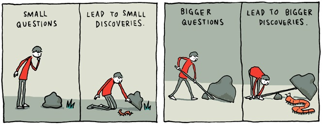

Often in school, programming students have a tough time asking questions. Most of the time, the problem is not knowing when to ask a question and what is considered a good question. Students are hesitant to ask as they are ashamed that their problem is something trivial, which could lead to them coming off as either dumb or just someone holding up the class with a question is answered by paying attention in class. The latter was something I experience during summer school. Another student kept asking questions that are very obvious if she was paying attention, such as what is this or what is that. Not only was it taking up time that the professor could use to teach other materials or answer a more in-depth question but quite frankly, it was annoying. Programming is a relatively new thing, so it is often tricky to differentiate between which problems require skilled people's help and which Google could solve.

The article ["How To Ask Question The Smart Way"](http://www.catb.org/esr/faqs/smart-questions.html) by Eric Steven Raymond can guide students through this dilemma. The article highlights what you should think about before asking a question, how to ask the question, and where to ask the question. [Is there a problem with my code?](https://stackoverflow.com/questions/65934125/is-there-a-problem-with-my-code-python-3-72) is an example of a problem that according to Raymond, is not a smart question. This user fails to identify precisely the problem with their code and only states what it is supposed to do. One of Raymond's big tip was "Be precise and informative about your problem."  By failing to do so, the user decreases their chance of receiving an answer to address their exact problem and the speed at which they get the response.

[This question](https://stackoverflow.com/questions/14220321/how-do-i-return-the-response-from-an-asynchronous-call) is an example that passes the qualifications set by Raymond to be a smart question. Starting with the main question, the user clearly explains what they need help with, allowing others to provide an answer that will directly solve their problem. The user then explains what their code does, which can help others have an easier time understanding what their reading. And finally, the user indicates that they have tried multiple methods instead of going straight to others for the answer. By doing so, the user helps eliminate possible wrong solutions the answerer could give.  

By following these techniques provided by Raymond, programmers could lower their chance of embarrassing themselves by asking a question that is basic knowledge. It will also help them get the right answer that will solve the problem. Raymond says that skillful hackers are often hostile towards people who are unwilling to do their homework beforehand as they are busy and filter the questions ruthlessly. Therefore, although having many questions is not bad, be sure to think through them carefully before putting them on forums so as not to waste everybody's time
