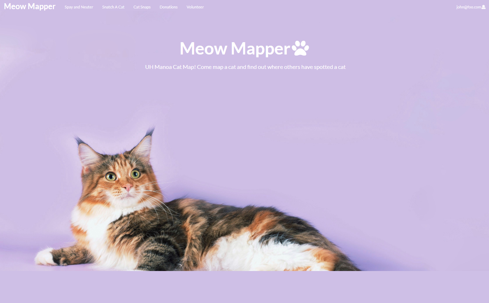
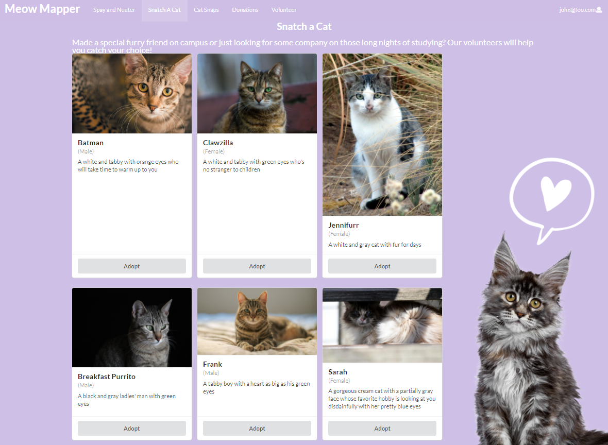
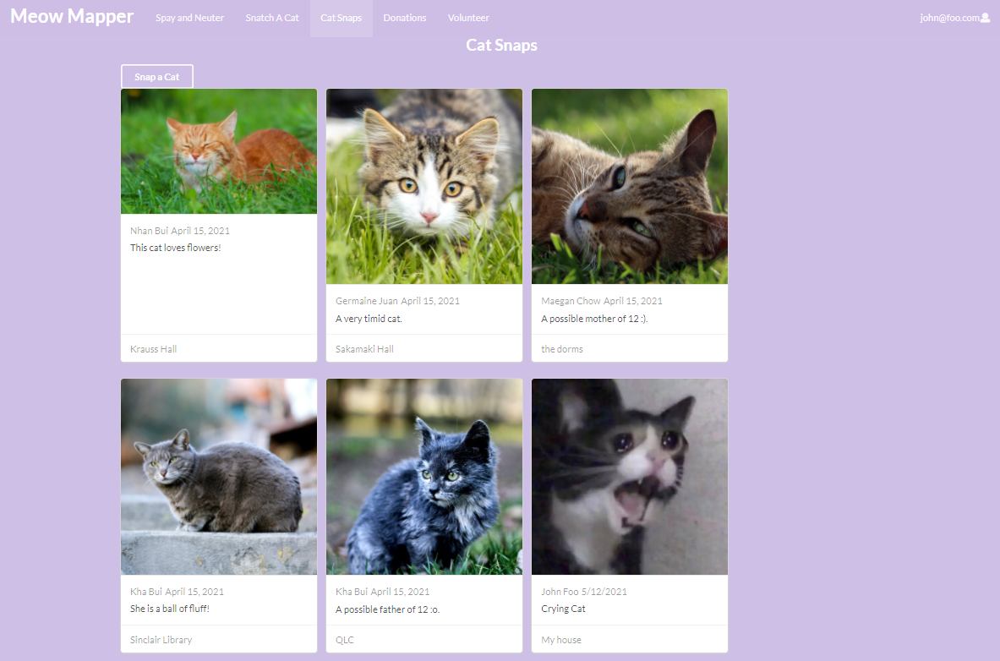
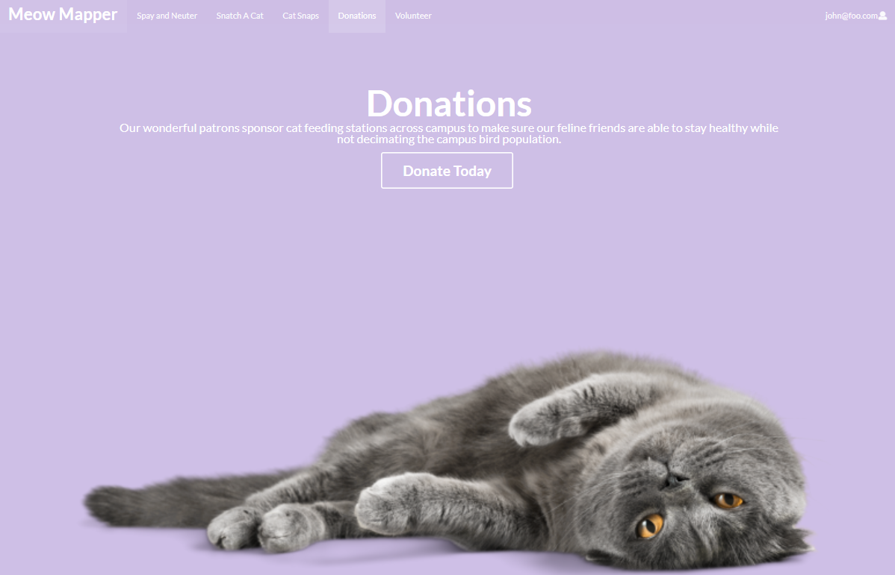
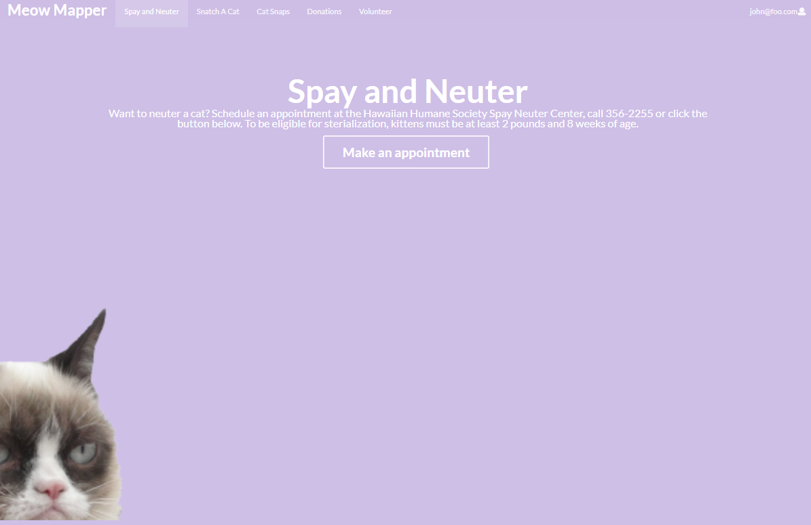
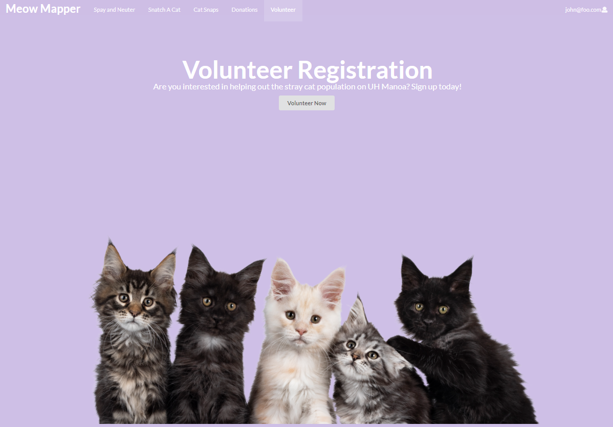

  
## About Meow Mapper

At the UH Manoa campus, there is an abundance of cats roaming around. However, since cats are naturally introverts, they are difficult to spot. So my group and I decided to make a website dedicated to helping cat lovers find cats all over campus called Meow Mapper. The website will allow users to map cats they see on campus and check out where other users have found cats on campus. Along with this, users can adopt the cats on campus, donate money that will go towards buying food and other cat supplies, volunteer to help with the caretaking of the cats, or look at cat pictures. 

## The Website

The website has a minimalistic design with five subpages. The Spay and Neuter page links to the humane society website, where users can make appointments to get a cat spay and neuter. The Snatch A Cat page where users can sign up to adopt cats available for adoption. The Cat Snaps is where users upload cat pictures and locations or look at what others have uploaded. The donation page where the users can donate money and the volunteer page where they can volunteer to feed cats, find cats, etc. 

  
  
  
  
  

## Final OutCome

Although Meow Mapper is as functional as our skills will let us, I feel regretful that we could not have done more. The website has the cat's locations and pictures represented as cards. But I would like to have an actual map. The map would have pinpoints with the cat pictures on it, and if clicked on more information about the cats would show up. This project has been a wonderful learning experience for me to have. It showed me a little bit of what it is like to work in groups to code a project. I was fortunate enough to have people I already knew in my group; this made it easier for me to speak my opinions and have more creative inputs on the project. With this experience in my skillset, I look forward to working on more group projects with other computer science students and make more acquaintances. 

Our homepage can be found [here](https://meow-mapper.github.io/) and our source code can be found [here](https://github.com/meow-mapper/meow-mapper-deploy).

